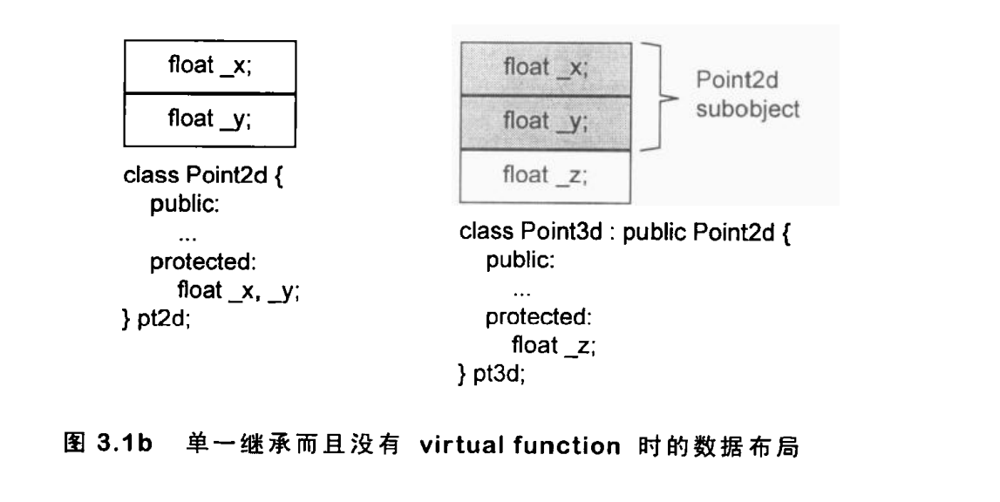
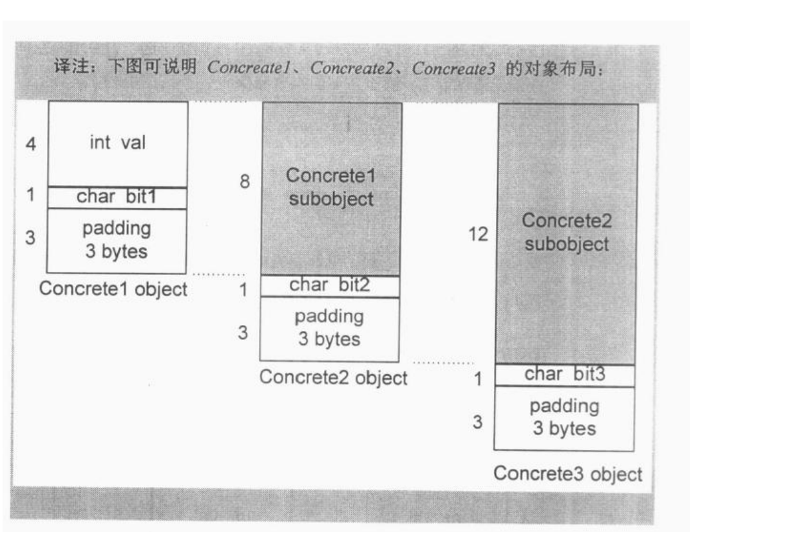
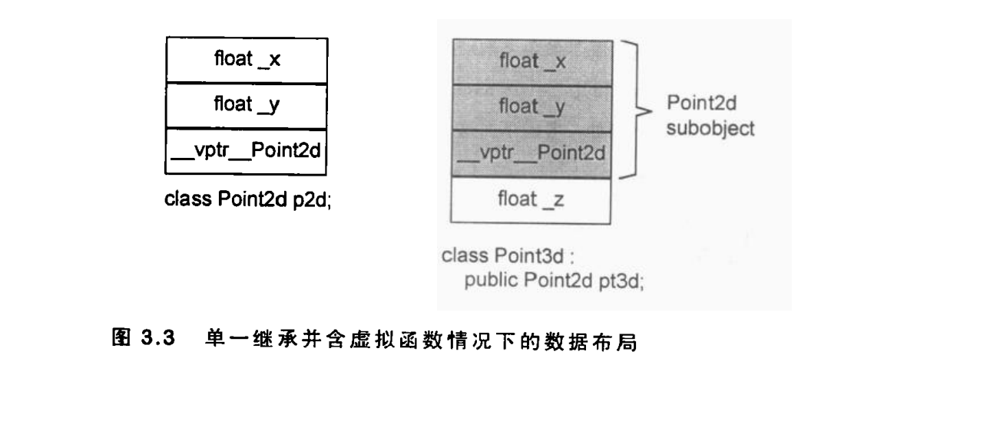
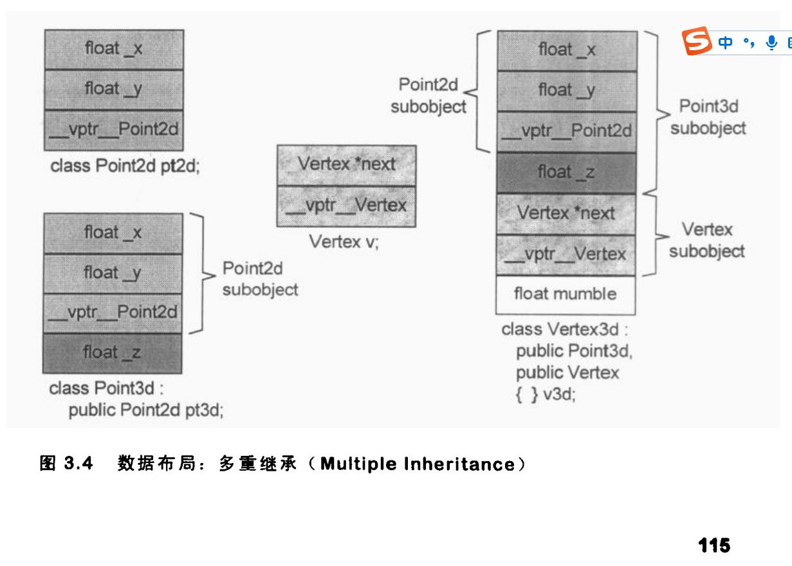
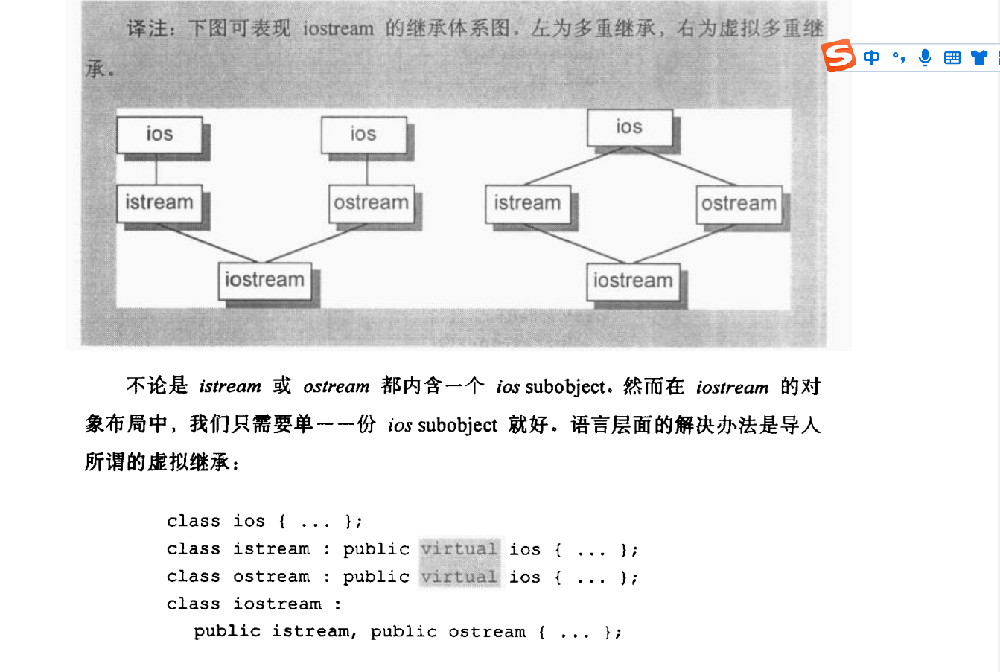
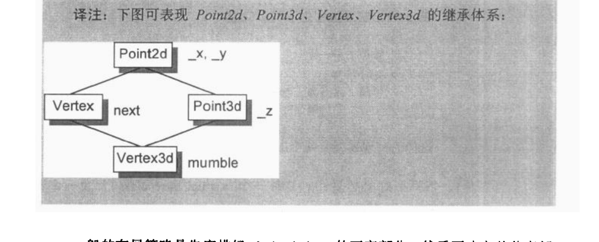
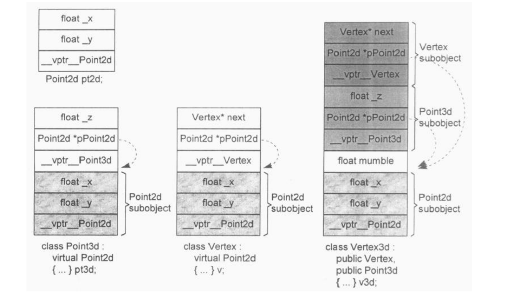
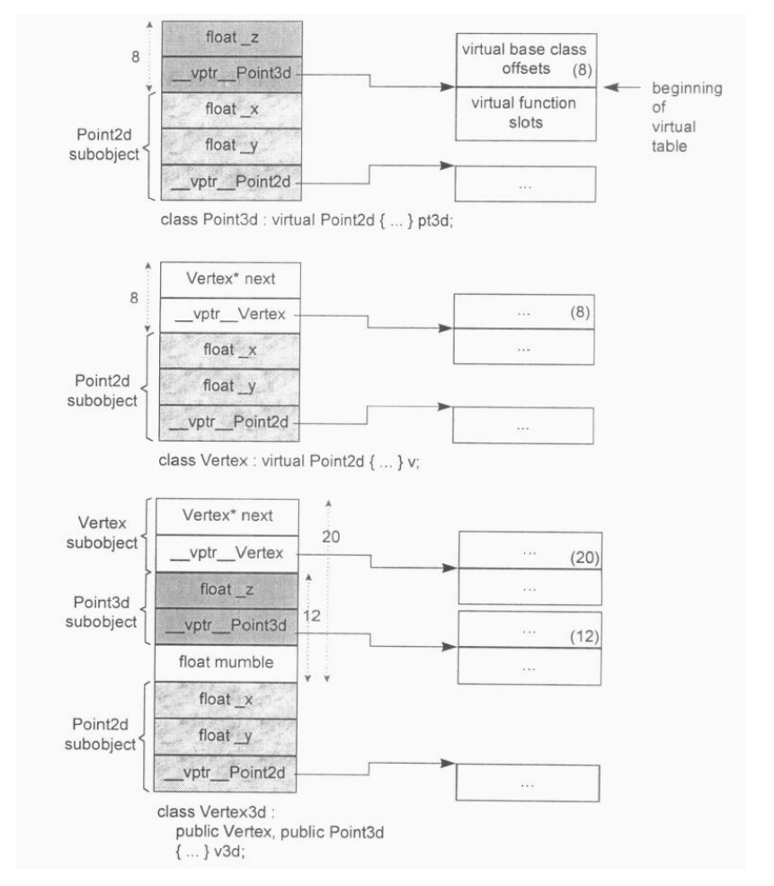

```c++
class X {};
class Y : public virtual X {};
class Z : public virtual X {};
class A : public Y, public Z {};
```
对X,Y,Z,A分别通过sizeof操作符取大小，如果在32位机上，sizeof(X)为1，尽管X为空，但编译器给其中插入了1个字节的占位符。这样，以下的代码
```c++
X a, b;
if ( &a == &b ) cerr << "yipes!" << endl;
```
a,b会被分配在不同的位置。


sizeof(Y),sizeof(Z)的值，如果编译器没有针对empty virtual base class的优化，则为8bytes,如果有针对emtpy virtual base class的优化，则为4byte
在没有empty virtual base class优化的情况下，X一个字节，为了支持virtual base class机制，存储了一个指针，padding 3字节。 如果支持empty virtual base class的优化，X的一个字节被省去，同时不再需要3字节的对齐，之后只需要4字节即可。

sizeof(A),同理，如果编译器没有针对empty virtual base class的优化， X virtual base class在A中只有一个subobject,占用1字节，Y,Z 除去X的一个字节和对齐，还剩下4个字节的指针，一共8字节。 加在一起共12字节。如果有empty virtual base class优化，则X的一个字节被省去，占用8字节。

### **The Binding of a Data Member**
以下代码中
```c
// A third party foo.h header file
// pulled in from somewhere
extern float x;
// the programmer's Point3d.h file
class Point3d
{
public:
  Point3d( float, float, float );
  // question: which x is returned and set?
  float X() const { return x; }
  void X( float new_x ) const { x = new_x; }
  // ...
private:
  float x, y, z;
};
```
现在编译器对Point3d::X()和Point3d::X(float)函数成员中，对x的解析，是解析到数据成员x的，而不是global data x。

然而早起并不是这样，早起的编译器将其解析到global data x,这种错误的解析方式，导致了两种defensive programming in the early use of C++：

1. Placing all data members first in the class declaration to ensure the right binding:
```c++
class Point3d
{
// defensive programming style #1
// place all data first ...
float x, y, z;
public:
  float X() const { return x; }
// ... etc. ...
};
```
2. Placing all inline functions, regardless of their size, outside the class declaration:
```c++
class Point3d
{
public:
   // defensive programming style #2
   // place all inlines outside the class
   Point3d();
   float X() const;
   void X( float ) const;
   // ... etc. ...
};

inline float Point3d::X() const
{
    return x;
}
// ... etc. ...
```
随着C++2.0的发布，这种用法已经没有必要的。
C++ 使用手册上声明了， the body of an inline function is not evaluated until after the entire class declaration is seen

然而，对于member function的参数列表的解析，却仍然是resolved in place at the point they are first encountered。

因此在extern和nested typenames之间的非直觉绑定操作还是会发生。例如在下面的程序片段中，length的类型在两个member function signatures中都决议（resolve）为global typedef，也就是int。当后续再有length的nested typedef声明出现时，编译器就把稍早的绑定标示为非法，报错。
```c++
typedef int length;
class Point3d
{
public:
// oops: length resolves to global
// ok: _val resolves to Point3d::_val
void mumble( length val ) { _val = val; }
length mumble() { return _val; }
// ...
private:
// length must be seen before its first
// reference within the class. This
// declaration makes the prior reference illegal.
typedef float length;
length _val;
// ...
};
```
```
test.cpp:15:15: error: declaration of ‘typedef float Point3d::length’ changes meaning of ‘length’ [-fpermissive]
    1 | typedef int length;
```
因此对于这种情况还是需要defensive programming style,请始终把“nested typedef声明"放在class的起始处.

### **Data Member Layout**
如下声明
```c++
class Point3d {
public:
// ...
private:
   float x;
   static List<Point3d*> *freeList;
   float y;
   static const int chunkSize = 250;
   float z;
};
```
Non static data members在class object中的排列顺序将和其被声明的顺序一样，static data members存储在程序的数据段中。 在上述例子里，每一个3d对象是由三个float组成，按照x,y,z的顺序，从低地址排列到高地址。

C++Standard要求，在同一个access section 中，members的排列只需符合“较晚出现的members在class object中有较高的地址"这一条件即可·也就是说，各个members并不一定得连续排列·什么东西可能会介于被声明的members之间呢？members的边界调整（alignment）可能就需要填补一些bytes

编译器还可能会合成一些内部使用的data members，比如vptr，当前所有的编译器都把它插在每一个“内含virtual function之class"的object内。vptr会被放在什么位置呢？传统上它被放在所有明确声明的members的最后。不过如今也有一些编译器把vptr放在一个class object的最前端。

C++Standard秉持先前所说的"对于布局所持的放任态度",允许编译器把那些内部产生出来的members自由放在任何位置上，甚至放在那些被程序员声明出来的members之间

C++ standard也允许编译器将多个access sections之中的data members自由排列，不必在乎它们出现在class声明中的次序。也就是说，下面这样的声明：
```c++
class Point3d {
public:
// ...
private:
   float x;
   static List<Point3d*> *freeList;
private:
   float y;
   static const int chunkSize = 250;
private:
   float z;
};
```
其class object的大小和组成都和我们先前声明的那个相同，但是members的排列次序则视译器而定。编译器可以随意把y或z或什么东西放为第一个，不过就我所知，当前没有任何编译器会这么做。

当前各家编译器都是把一个以上的access sections按照声明的次序存放。

Access sections的多寡并不会招来额外负担·例如在一个section中声明8个members，或是在8个sections中总共声明8个members，得到的object大小是一样的。


以下模板函数可用来判断哪个member 在前，哪个在后。其中data_type1 class_type::* 是指向类数据成员的指针，这个指针的值不是其具体在内存中的地址，而是member在类中的偏移量。

```c++
template< class class_type,class data_type1, class data_type2 >
char* access_order( data_type1 class_type::* mem1,data_type2 class_type::* mem2 )
{
   assert ( mem1 != mem2 );
   return mem1 < mem2 ? "member 1 occurs first" : "member 2 occurs first";
}
```
This function could then be invoked as follows:
`access_order( &Point3d::z, &Point3d::y );`
where class-type binds to `Point3d` and data_type1 and data_type2 bind to `float`.

### **Access of a Data Member**
以下的代码中
```c++
Point3d origin, *p=&origin;
origin.x=0.0;
p->x=0.0;
```
这两种存取方式有何差异？答案视Point3d和x如何声明而定。可能是个static member，也可能是个non static member。Point3d可能是个独立（非派生）的class，也可能是从另一个单一的base class派生而来；虽然可能性不高，但它甚至可能是从多重继承或虚拟继承而来。

事实上，这两种存取方式唯一存在差异的时候，就是当Point3d有虚基类，而x正是其虚基类的数据成员。

#### **Static Data Member**
static data members存储在object之外，在程序数据段中只有一份实例，被视为global variable(but with visibility limited to the scope of the class)

对static member的访问，不管是通过对象的访问，还是对象指针的访问，都是一样的，被解析到位于data segment中的唯一一份实例。这也是唯一的一种，通过对象访问和通过对象指针的访问，完全一样的情况，这里的完全一样，可以被理解为，这两种访问方式，被编译器编译成的程序指令，是完全一样的。

但如果static member是一个从复杂继承关系中继承而来的member，又当如何？或许它是一个“virtual class的virtual base class”（或其它同等复杂的继承结构）的member也说不定。哦，那无关紧要，程序之中对于static members还是只有唯一一个实体，而其存取路径仍然是那么直接。

如果static data member的存取是经由函数调用（或其它某些语法）而被存取呢？举个例子，如果我们写：
`foobar().chunkSize = 250;`
调用foobar()会发生什么事情？cfront的做法是简单地把它丢掉。但C++ standard明确要求foobar()被求值（evaluated），虽然其结果并无用处。

下面是一种可能的转化：
```c++
// foobar().chunkSize == 250;
// evaluate expression, discarding result
(void) foobar();
Point3d::chunkSize = 250;
```

Taking the address of a static data member yields an ordinary pointer of its data type, not a pointer to class member, since the static member is not contained within a class object. For example,
```c++
&Point3d::chunkSize
```
yields an actual memory address of type
```c++
const int*
```

如果有两个classes的static data members同名，那么当它们 都被放在程序的data segment时，就会导致名称冲突。

编译器的解决方法是暗中对每一个static data member的名称编码，也就是name-mangling。以获得一个独一无二的程序识别代码。有多少个编译器，就有多少种name-mangling做法！通常不外乎是表格啦、语法措辞啦等等。任何name-mangling做法都有两个要点：
* 一种算法，推导出独一无二的名称。
* 万一编译系统（或环境工具）必须和使用者交谈，那些独一无二的名称可以轻易被推导回到原来的名称

#### **NonStatic Data Members**
Nonsatic data members直接存放在每一个class object之中。除非经由明确的（explicit）或暗喻的（implicit）class object访问，没有办法直接存取它们。

this指针就是一个implicit class object.
```c++
void Point3d::translate( const Point3d &pt ) {
x += pt.x;
y += pt.y;
z += pt.z;
}
```
这个成员函数会被编译器转换成如下
```c++
// internal augmentation of member function
void  Point3d::translate( Point3d *const this, const Point3d &pt ) {
this->x += pt.x;
this->y += pt.y;
this->z += pt.z;
}
```
对每个class object,其non static data member的偏移量（offset）在编译时期即可获知，甚至如果member属于一个virtual base class object（派生自单一或多重继承串链）也是一样·

因此直接通过对象的访问，都是能在编译时期解析到明确的地址的。

在通过指针访问的情况下，如果访问的数据成员为virtual base class的成员,因为不确定指针所指向对象的具体类型，而virtual base class 的机制，导致虚基类在不同的derived class 中的偏移是不确定的，需要引入一层间接性。因此对具体地址解析，延迟到了运行时。


因此对于下面这段程序代码，这两种方式存区方式唯一的不同，就在于，如果Point3d 是个派生类，其继承结构中有个virtual base class,而x是属于这个virtual base calss的。
```c++
Point3d origin, *p=&origin;
origin.x=0.0;
p->x=0.0;
```
这时候我们不能够说p必然指向哪一种class type（因此我们也就在编译时期不知道这个member真正的offset位置）（如果没有虚拟继承，即使通过指针，虽然指针指向的对象的真正类型也是未知的，但每个元素的偏移量在所有的派生类型中都是确定的，或者说每个subobject在派生类中的偏移量都是确定的，编译器会在内部给指针加上偏移量，指向正确的subobject.只有存在虚基类的情况下，虚基类subobject的偏移量在不同的派生类中才会不同），所以这个存取操作必须延迟至执行期，经由一个额外的间接导引，才能够决.

但如果使用origin,就不会有这些问题，其类型无疑是Point3d，而即使它继承自virtual base class，members的offset位置也在编译时期就固定了，对其地址的解析，在编译时期就可以完成。

### **Inheritance and the Data Member**
在C++继承模型中，一个class object所表现出来的东西，是其自己的data members加上父类的data members的总和。

至于derived class members 和base classces members的排列次序并未在C++ Standard中强制指定：理论上编译器可以自由安排之。在大部分编译器的实现中，base class members总是先出现，但属于virtual base class的除外

#### **Inheritance without Polymorphism**


```c++
class Point2d {
public:
  Point2d( float x = 0.0, float y = 0.0 )
  : _x( x ), _y( y ) {};
  float x() { return _x; }
  float y() { return _y; }
  void x( float newX ) { _x = newX; }
  void y( float newY ) { _y = newY; }
  void operator+=( const Point2d& rhs ) {
    _x += rhs.x();
    _y += rhs.y();
  }
// ... more members
protected:
  float _x, _y;
};

// inheritance from concrete class
class Point3d : public Point2d {
public:
  Point3d( float x = 0.0, float y = 0.0, float z = 0.0 )
  : Point2d( x, y ), _z( z ) {};
  float z() { return _z; }
  void z( float newZ ) { _z = newZ; }
  void operator+=( const Point3d& rhs ) {
    Point2d::operator+=( rhs );
    _z += rhs.z();
}
// ... more members
protected:
  float _z;
};
```
其class object的布局如下


把一个class分解为两层或更多层，有可能会膨胀所需空间。c++语言保证“出现在derived class中的base class subobject有其完整原样性"，正是重点所在.

如下的Concrete对象只占用8个字节，（32位机子上）
```c++
class Concrete {
public:
// ...
private:
int val;
char c1;
char c2;
char c3;
};
```
而如果分层如下
```c++
class Concrete1 {
public:
// ...
protected:
int val;
char bit1;
};
class Concrete2 : public Concrete1 {
public:
// ...
protected:
char bit2;
};
class Concrete3 : public Concrete2 {
public:
// ...
protected:
char bit3;
};
```
则最后的Concrete3对象会占用16个字节，而Concrete2对象也会占用12个字节。


#### **Adding Polymorphism**
```c++
class Point2d {
public:
  Point2d( float x = 0.0, float y = 0.0 )
  : _x( x ), _y( y ) {};
  // access functions for x & y same as above
  // invariant across type: not made virtual
  // add placeholders for z — do nothing ...
  virtual float z(){ return 0.0 };
  virtual void z( float ) {}
  // turn type explicit operations virtual
  virtual void operator+=( const Point2d& rhs ) {
   _x += rhs.x(); _y += rhs.y(); 
  }
  // ... more members
protected:
  float _x, _y;
};

class Point3d : public Point2d {
public:
  Point3d( float x = 0.0, float y = 0.0, float z = 0.0 )
  : Point2d( x, y ), _z( z ) {};
  float z() { return _z; }
  void z( float newZ ) { _z = newZ; }
  void operator+=( const Point2d& rhs ) {
    Point2d::operator+=( rhs );
    _z += rhs.z();
  }
// ... more members
protected:
float _z;
};
```

*  导人一个和Point2d有关的virtual table，用来存放它所声明的每一个virtual functions的地址。这个table的元素数目一般而言是被声明的virtual functions的数目，再加上一个或两个slots（用以支持runtime type identification）

* 在每一个class object中导人一个vptr，提供执行期的链接，使每一个object能够找到相应的virtual table.

* 加强constructor，使它能够为vptr设定初值，让它指向class所对应的virtual table,这可能意味着在derived class和每一个base class constructor中，重新设定vptr的值。

* Augmentation of the destructor to reset the vptr to the associated virtual table of the class. (It is likely to have been set to address the virtual table of the derived class within the destructor of the derived class. Remember, the order of destructor calls is in reverse: derived class and then base class.) An aggressive optimizing compiler can suppress a great many of these assignments.

假设vptr被放在对象的末尾，则此时，Point2d 和Point3d的布局如下


#### **Multiple Inheritance**
单一继承提供了一种“自然多态（natural polymorphism）"形式，是关于classes体系中的base type和derived type之间的转换。下面这样的指定操作：
```c++
P0int3d p3d;
P0int2d* p=&p3d;
```
把一个derived class 指针赋值给base class的指针，该操作并不需要编译器去修改地址，它很自然地可以发生，而且提供了最佳执行效率。

当然如果将vptr放在对象的头部，而如果base class中没有virtual function，把一个derived class 地址转换为 base class的地址，就需要编译器调整了。

如果是如下的多重继承
```c++
class Point2d {
public:
// ...
protected:
float _x, _y;
};

class Point3d: public Point2d {
public:
// ...
protected:
float _z;
};

class Vertex {
public:
// ...
protected:
Vertex *next;
};

class Vertex3d : public Point3d, public Vertex {
public:
//...
protected:
float mumble;
};
```
对一个多重派生对象，将其地址指定给“最左端（也就是第一个）base class的指针"，情况将和单一继承时相同，因为二者都指向相同的起始地址。需付出的成本只有地址的指定操作而已。至于第二个或后继的base class 的地址指定操作，则需要将地址修改：加上（或减去）介于中间的base class subobject(s)大小，例如：
```c++
Vertex3d v3d;
Vertex *pv;
Point2d *pp;
Point3d *p3d;
```
the assignment
```c++
pv = &v3d;
```
requires a conversion of the form
```c++
// Pseudo C++ Code
pv = (Vertex*)(((char*)&v3d) + sizeof( Point3d ));
```
whereas the assignments
```c++
pp = &v3d;
p3d = &v3d;
```
both simply require a copying of the address. With
```c++
Vertex3d *p3d;
Vertex *pv;
```
the assignment
```c++
pv = p3d;
```
cannot simply be converted into
```c++
pv = (Vertex*)((char*)p3d) + sizeof( Point3d );
```
since, if p3d were set to 0, pv would end up with the value sizeof(Point3d). So, for pointers, the internal conversion requires a conditional test:
```c++
// Pseudo C++ Code
pv = p3d
? (Vertex*)((char*)p3d) + sizeof( Point3d )
: 0;
```
Conversion of a reference need not defend itself against a possible 0 value, since the reference cannot refer to no object.

C++ Standard并未要求Vertex3d中的base classes Point3d和Vertex有特定的排列次序。原始的cfront编译器是根据声明次序来排列它们。因此cfront编译器制作出来的Vertex3d对象，将可被视为是一个Point3d subobject（其中又有一个Point2d subobject）加上一个Vertex subobject，最后再加上Vertex3d自己的部分。目前各编译器仍然是以此方式完成多重base classes的布局（但如果加上虚拟继承，就不一样了）。


What about access of a data member of a second or subsequent base class? Is there an additional cost? **No.The member's location is fixed at compile time. Hence its access is a simple offset the same as under single inheritance regardless of whether it is a pointer, reference, or object through which the member is being accessed.**

#### **Virtual Inheritance**
多重继承会导致某个基类在派生类中存在多个subobject,如下

The general implementation solution is as follows. A class containing one or more virtual base class subobjects, such as istream, is divided into two regions: an **invariant region** and a **shared region**. Data within the invariant region remains at a fixed offset from the start of the object regardless of subsequent derivations. So members within the invariant region can be accessed directly. The shared region represents the virtual base class subobjects. The location of data within the shared region fluctuates with each derivation. So members within the shared region need to be accessed indirectly. What has varied among implementations is the method of indirect access. 

假设如下的虚拟继承链
```c++
class Point2d {
public:
...
protected:
float _x, _y;
};
class Vertex : public virtual Point2d {
public:
...
protected:
Vertex *next;
};
class Point3d : public virtual Point2d {
public:
...
protected:
float _z;
};
class Vertex3d :
public Point3d, public Vertex {
public:
...
protected:
float mumble;
};
```

一般的布局策略是先安排好derived class的不变部分，然后再建立其共享部分·

而对共享部分的存取，cfront编译器会在每一个derived class object中安插一些指针，每个指针指向一个virtual base class subobject·要存取继承得来的virtual base class  subobject members，可以使用相关指针间接完成·如下：
```c++ 
void Point3d::operator+=( const Point3d &rhs )
{
_x += rhs._x;
_y += rhs._y;
_z += rhs._z;
};
```
under the cfront strategy, this is transformed internally into
```c++
// Pseudo C++ Code
__vbcPoint2d->_x += rhs.__vbcPoint2d->_x;
__vbcPoint2d->_y += rhs.__vbcPoint2d->_y;
_z += rhs._z;
```

A conversion between the derived and base class instances, such as
```c++
Point2d *pv = pv3d;
```
under the cfront implementation model becomes
```c++
// Pseudo C++ code
Point2d *pv = pv3d ? pv3d->__vbcPoint2d : 0;
```

另一种实现方式是在virtual function table中存放virtual base class的偏移。

在新近的sun编译器中，virtual function table可经由正值或负值来索引。如果是正值，很显然就是索引到virtual functions;如果是负值，则是索引到virtual base class offset . 在这样的策略之下，Point3d的operator+=运算符必须被转换为以下形式：
```c++
// Pseudo C++ Code
(this + __vptr__Point3d[-1])->_x +=(&rhs + rhs.__vptr__Point3d[-1])->_x;
(this + __vptr__Point3d[-1])->_y +=(&rhs + rhs.__vptr__Point3d[-1])->_y;
_z += rhs._z;
```

以上两种布局方式如下
* 存储指向共享部分的指针

* 在vtbl中存储共享部分的偏移

注意在virtual继承的情况下，派生类会有自己的vptr

上述每一种方法都是一种实现模型，而不是一种标准．每一种模型都是用来解决“存取shared subobject内的数据（其位置会因每次派生操作而有变化）”所引发的问题，由于对virtual base class的支持带来额外的负担以及高度的复杂性，每一种实现模型多少有点不同，而且我想还会随着时间而进化．


经由一个class object来存取一个继承而来的virtual base class的member，像这样：
```c++
Point3d origin;
origin.x：
```
可以被优化为一个直接存取操作，就好像一个经由对象调用的virtual function，可以在编译时期被决议（resolved）完成一样· 一个确定的object,其所有的成员，不管是不是继承而来的，是自己的还是父类的，父类是不是虚基类，其成员的位置都是固定的，偏移量在编译期已知。

一般而言，virtual class最有效的一种运用形式就是：一个抽象的virtual base class，没有任何data members·

### **Pointer to Data Members**
有如下类
```c++
class Point3d {
public:
virtual ~Point3d();
// ...
protected:
static Point3d origin;
float x, y, z;
};
```
下面的表达式返回z data member在Point3d对象中的偏移，其类型是`float Point3d::*`
```c++
&Point3d::z;
```
如果当前编译器的实现将vptr放在对象的尾部，则上述表达式的值应该是9，也就是实际的偏移值+1，+1的主要目的是为了区分没有指向任何data member的指针，和指向第一个data member的指针。

而如果表达式为
```c++
&origin.z
```
则返回的是z在内存中的地址，类型为float*,不再是偏移量。将该结果减去z的偏移量再+1，就是origin在内存中的地址。

在多重继承下
```c
struct Base1 { int val1; };
struct Base2 { int val2; };
struct Derived : Base1, Base2 { ... };
void func1( int Derived::*dmp, Derived *pd )
{
  // expects a derived pointer to member
  // what if we pass it a base pointer?
  pd->*dmp;
}
void func2( Derived *pd )
{
  // assigns bmp 1
  int Base2::*bmp = &Base2::val2;
  // oops: bmp == 1,
  // but in Derived, val2 == 5
  func1( bmp, pd )
}
```
这时候，编译器需要将最后的func1调用在内部转换为
```c++
// internal transformation
// guarding against bmp == 0
func1( bmp ? bmp + sizeof( Base1 ) : 0, pd );
```
否则，pd->*dmp就会取到Base1::val1的值，而不是Base2::val2