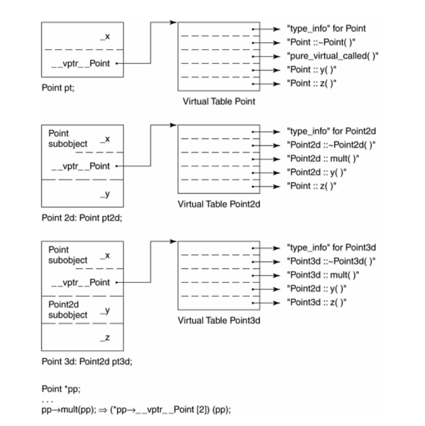

### **Member Function的各种调用方式**

#### **Nonstatic member function**
假设有如下的Nonstatic member function
```c++
float
Point3d::magnitude() const
{
    return sqrt(_x * _x + _y * _y + _z * _z);
}
```
其内部转换过程如下
* 改写函数签名，加入this指针
  ```c++
  float Point::magnitude(const Point* const this)
  ```
  如果不是const成员函数，则加入的this指针如下
  ```c++
  float Point::magnitude(Point* const this)
  ```
* 对每一个non static data member的操作改为经由this指针来存取
  ```c++
  {
  return sqrt(
  this->_x * this->_x +
  this->_y * this->_y +
  this->_z * this->_z );
  }
  ```
* Rewrite the member function into an external function, mangling its name so that it's lexically unique within the program:
```c++
extern magnitude__7Point3dFv(register const Point3d *const this );
```

Now that the function has been transformed, each of its invocations must also be transformed. Hence
```c++
obj.magnitude();
```
becomes
```c++
magnitude__7Point3dFv( &obj );
```
and
```c++
ptr->magnitude();
```
becomes
```c++
magnitude__7Point3dFv( ptr );
```

假设Point3d的nonstatic member function
```c++
Point3d Point3d::normalize() const
{
  register float mag = magnitude();
  Point3d normal;
  normal._x = _x/mag;
  normal._y = _y/mag;
  normal._z = _z/mag;
  return normal;
}
```
会被内部转换为(假设Point3d声明了拷贝构造函数，编译器应用了NRV优化)
```c++
// Representing internal transformation
// with application of named return value
// Pseudo C++ Code
void
normalize__7Point3dFv( register const Point3d *const this,
Point3d &__result )
{
register float mag = this->magnitude();
// default constructor
__result.Point3d::Point3d();
__result._x = this->_x/mag;
__result._y = this->_y/mag;
__result._z = this->_z/mag;
return;
}
```

假如normalize是这样被定义的
```c++
// slightly more efficient user implementation
Point3d
Point3d::normalize() const
{
register float mag = magnitude();
return Point3d( _x/mag, _y/mag, _x/mag );
}
```
则其的内部转换会更高效，不需要先调用默认构造函数，再重写的浪费.
```c++
// Representing internal transformation
// Pseudo C++ Code
void
normalize__7Point3dFv( register const Point3d *const this,
Point3d &__result )
{
register float mag = this->magnitude();
// __result substituted for return value
__result.Point3d::Point3d(
this->_x/mag, this->_y/mag, this->_z/mag );
return;
}
```

#### **Name Mangling**
对类的数据成员的name mangling通常是将数据成员的名字加上类的名字，如下
```c++
class Bar { public: int ival; ... };
```
a possible data member name-mangling`ival__3Bar`;

这样假设我们有如下的继承关系
```c++
class Foo : public Bar { public: int ival; ... };
```
Remember that the internal representation of a Foo object is the concatenation of its base and derived class members:
```c++
// Pseudo C++ Code
// internal representation of Foo
class Foo { 
public:
  int ival__3Bar;
  int ival__3Foo;
...
};
```

而在user code中，对于重名的数据成员的处理，就是加上成员选择操作符：
```c++
Foo f;
f.Bar::ival=1; //访问的是ival__3Bar;
f.ival=2; //访问的是ival__3Foo;
```

因为函数成员可以被重载，因此其name mangling的规则要更复杂些。
```c++
class Point { 
public:
  void x( float newX );
  float x();
}
```
如果仅仅是加上类名，是不够的
```c++
class Point { 
public:
  void x__5Point( float newX );
  float x__5Point();
...
};
```
还需要加上其参数列表一起mangle
```c++
class Point { 
public:
  void x__5PointFf( float newX );
  float x__5PointFv();
...
};
```

当然，如果不是成员函数，也需要name mangling,只不过没有类名就是了 。而 `extern "C"`的声明，会让global function 的名称不被mangle

#### **virtual member function**
如果normalize是一个virtual member function
```c++
ptr->normalize();
```
将会被内部转化为：
```c++
(*ptr->vptr[1])(ptr);
```
其中：
* vptr表示由编译器产生的指针指向virtual table。事实上其名称也会被mangled,因为可能存在有多个vptrs.
* 1是virtual table slot的索引值，关联到normalize()函数
* 第二个ptr表示this指针·

如果我们通过object调用virtual function
```c++
// Point3d obj;
obj.normalize();
```
如果编译器也内部转换为如下通过虚函数表的调用
```c++
// unnecessary internal transformation!
( * obj.vptr[ 1 ])( &obj );
```
这是没有必要并且低效的。因为object是个Point3d class object，其类型已经确定了，因此没有必要再通过虚函数表调用，直接在编译器中被转换成
```c++
normalize__7Point3dFv( &obj );
```
效率更高。并且，如果这个函数是inline的，这样转换可以应用inline函数原地拓展。

#### **static member function**
If Point3d::normalize() were a static member function, both its invocations
```c++
obj.normalize();
ptr->normalize();
```
would be internally transformed into "ordinary" nonmember function calls such as
```c++
// obj.normalize();
normalize__7Point3dSFv();
// ptr->normalize();
normalize__7Point3dSFv();
```

static member function 相对于non static member function就是没有this指针，只能访问static data member，不能访问nonstatic data member 

同时， static member function不能被声明为const,volatile,virtual

如果使用成员选择符直接调用static member function
```c++
if ( Point3d::object_count() > 1 ) ...
```
member selection的使用只是一种符号上的便利，它会被转化为一个直接调用操作

What if the class object is obtained as a side effect of some expression, such as a function call:
```c++
if ( foo().object_count() > 1 ) ...
```
The expression still needs to be evaluated:
```c++
// transformation to preserve side-effects
(void) foo();
if ( Point3d::object_count() > 1 ) ...
```
A static member function, of course, is also lifted out of the class declaration and given a suitably mangled name. For example,
```c++
unsigned int Point3d::object_count()
{
    return _object_count;
}
```
under cfront is transformed internally into
```c++
// internal transformaton under cfront
unsigned int object_count__5Point3dSFv()
{
    return _object_count__5Point3d;
}
```
where `SFv` indicates it is a static member function with an empty (void) argument list.

```c++
&Point3d::object_count();
```
yields a value of type
```c++
unsigned int (*)();
```
not of type
```c++
unsigned int ( Point3d::* )();
```

### **Virtual Member Function**
一个class 的虚函数表中的虚函数包括
* 这个class定义的虚函数。它可能重写了基类的虚函数
* 继承自基类的虚函数，没有被这个class重写
* A pure_virtual_called() library instance that serves as both a placeholder for a pure virtual function and a runtime exception should the instance somehow be invoked

Each virtual function is assigned a fixed index in the virtual table. This index remains associated with the particular virtual function throughout the inheritance hierarchy. In our Point class hierarchy, for example,
```c++
class Point {
public:
  virtual ~Point();
  virtual Point& mult( float ) = 0;
  // ... other operations ...
  float x() const { return _x; }
  virtual float y() const { return 0; }
  virtual float z() const { return 0; }
  // ...
protected:
  Point( float x = 0.0 );
  float _x;
};
```
the virtual destructor is likely to be assigned slot 1 and mult() assigned slot 2. (In this case, there is no mult() definition, so the address of the library function pure_virtual_called() is placed within the slot. If that instance should by some accident get invoked, generally it would terminate the program.) y() is assigned slot 3 and z() slot 4.

当Point2d继承自Point时
```c++
class Point2d : public Point {
public:
  Point2d( float x = 0.0, float y = 0.0 )
  : Point( x ), _y( y ) {}
  ~Point2d();
  // overridden base class virtual functions
  Point2d& mult( float );
  float y() const { return _y; }
  // ... other operations ...
protected:
  float _y;
};
```
There are three possibilities:
1. It can inherit the instance of the virtual function declared within the base class. Literally, the address of that instance is copied into the associated slot in the derived class's virtual table.
2. It can override the instance with one of its own. In this case, the address of its instance is placed within the associated slot.
3. It can introduce a new virtual function not present in the base class. In this case, the virtual table is grown by a slot and the address of the function is placed within that slot.

Point2d's virtual table addresses its destructor in slot 1 and its instance of mult() in slot 2 (replacing the pure virtual instance). It addresses its instance of y() in slot 3 and retains Point's inherited instance of z() in slot 4.

最后Point3d继承自Point2d
```c++
class Point3d: public Point2d {
public:
   Point3d( float x = 0.0,
   float y = 0.0, float z = 0.0 )
   : Point2d( x, y ), _z( z ) {}
   ~Point3d();
   // overridden base class virtual functions
   Point3d& mult( float );
   float z() const { return _z; }
   // ... other operations ...
protected:
  float _z;
};
```

generates a virtual table with Point3d's destructor in slot 1 and Point3d's instance of mult() in slot 2. It
places Point2d's inherited instance of y() in slot 3 and Point3d's instance of z() in slot 4.

以上三个class object以及其virtual table的布局如下，假设编译器将vptr放置在对象尾部


#### **多重继承下的Virtual Function**

```c++
// hierarchy to illustrate MI complications
// of virtual function support
class Base1 {
public:
   Base1();
   virtual ~Base1();
   virtual void speakClearly();
   virtual Base1 *clone() const;
protected:
   float data_Base1;
};

class Base2 {
public:
   Base2();
   virtual ~Base2();
   virtual void mumble();
   virtual Base2 *clone() const;
protected:
   float data_Base2;
};

class Derived : public Base1, public Base2 {
public:
   Derived();
   virtual ~Derived();
   virtual Derived *clone() const;
protected:
   float data_Derived;
};
```
Derived支持virtual functions的困难度统统落在Base2 subobject身上。有三个问题需要解决，以此例而言分别是(1)virtual destructor（2）被继承下来的Base2::mumble()，（3）一组clone()函数实体. 让我依次解决每一个问题

**virtual destructor**

First, let's assign a Base2 pointer the address of a Derived class object allocated on the heap:
```c++
Base2 *pbase2 = new Derived;
```

The address of the new Derived object must be adjusted to address its Base2 subobject. The code to accomplish this is generated at compile time:
```c++
// transformation to support second base class
Derived *temp = new Derived;
Base2 *pbase2 = temp ? temp + sizeof( Base1 ) : 0;
```

如果没有以上的转换，则下面的访问操作会失败
```c++
// ok even if pbase2 assigned Derived object
pbase2->data_Base2;
```

而当我们需要调用delete 函数对象时
```c++
delete pbase2;
```
pbase2指针必须再一次被调整，以指向Derived的起始处。

然而当我们调用delete pbase2时，编译器还能确定pbase2还指向原来的Derived对象中的Base2 subobject么？显然是不能的。此时pbase2也可能就指向一个Base2对象，指针压根不需要调整。

因此，这个this指针的调整值只能在运行时才能确定。因为只有运行时才知道pbase2指针指向的对象到底什么。

所以，这个调整值，要存储在对象的某个地方，一种方法是，在虚函数表中，和指向虚函数的指针存储在一起。也就是说，虚函数表中的每个对象不单单是一个指针，还包括一个偏移量，这个偏移量需要在调用时加到this指针上。

The virtual function call changed from
```c++
( *pbase2->vptr[1])( pbase2 );
```
into
```c++
( *pbase2->vptr[1].faddr)( pbase2 + pbase2->vptr[1].offset );
```
where faddr held the virtual function address and offset held the necessary this pointer adjustment.

这个做法的缺点是，它相当于连带处罚了所有的virtual function调用操作,不它们是否需要this指针的调整·我所谓的处罚，包括offset的额外存取及其加法，以及每一个virtual table slot的大小改变。

另一种方法，是使用所谓的thunk技术，所谓的thunk就是一小段assembly code，其中包括调整this指针和跳转virtual function去执行。

如果虚函数表中的某个函数在被调用时需要调整this指针，虚函数表中就存储该thunk的指针，否则存储函数的指针即可。

调整this指针的第二个额外负担就是，由于两种不同的可能：(1)经由derived class（或第一个base class）调用，（2）经由第二个（或其后继）base class调用，同函数在virtual table中可能需要多笔对应的slots·例如：

```c++
Base1 *pbase1 = new Derived;
Base2 *pbase2 = new Derived;
delete pbase1;
delete pbase2;
```
虽然两个delete操作导致相同的Derived destructor被调用，但它们需要两个不同的virtual table slots
1. pbase1 does not require a this pointer adjustment (being leftmost, it already points to the beginning of the Derived class object). Its virtual table slot requires the actual destructor address.
   
2. pbase2 does require a this pointer adjustment. Its virtual table slot requires the address of the associated thunk.

<font color=red>以下应该不准确</font>
在多重继承之下，一个derived class内含n个virtual tables，n表示其上一层base classes的数目，当然，其每一个base class中要有虚函数，不管这个虚函数是自己的还是继承的。

在单一继承下，不会产生额外的virtual tables.

以上两种情况均不包括虚拟继承。
<font color=red>以上</font>


对于本例Derived class而言，会有两个virtual tables被编译器产生出来：

1. The primary instance shared with Base1, its leftmost base class
2. A secondary instance associated with Base2, the second base class

The Derived class object contains a vptr for each associated virtual table. The vptrs are initialized within the constructor(s) through code generated by the compiler.


用以支持“一个class拥有多个virtual tables"的传统方法是，将每一个tables以外部对象的形式产生出来，并给予独一无二的名称。例如，Derived所关联的两个tables可能有这样的名称：
```c++
vtbl__Derived; // the primary table
vtbl__Base2__Derived; // the secondary table
```
于是当你将一个Derived对象地址指定给一个Base指针或Derived指针时，被处理的virtual table是vtbl__Derived。而当你将一个Derived对象地址指定给一个Base2指针时，被处理的virtual table是vtbl__Base2__Derived.

**被继承下来的Base2::mumble()**

通过一个“指向derived class”的指针，调用第二个base class中一个继承而来的virtual function。在此情况下，derived class指针必须再次调整，以指向第二个base class subobject。例如：
```c++
Derived *pder = new Derived;
// invokes Base2::mumble()
// pder must be adjusted forward by sizeof( Base1 )
pder->mumble();
```
可能的转换如下，如果其实现是修改虚函数表中每个slot中的格式的话：
```c++
(*pder->vtbl__Derived[4].faddr)(pder+pder->vtbl__Derived[4].offset)
```
  
**一组clone()函数实体**
第三种情况发生于一个语言的扩充性质之下：允许一个virtual function的返回值类型有所变化，可能是base type，也可能是publicly derived type。这一点可以通过Derived::clone()函数实体来说明。clone函数的Derived版本传回一个Derived class指针，默默地改写了它的两个base class中的函数实体。当我们通过“指向第二个base”的指针来调用clone时，this指针又需要调整了：
```c++
Base2 *pb2 = new Derived;
// invokes Derived* Derived::clone()
// return must be adjusted to address Base2 subobject
Base2 *pb2_2 = pb2->clone();
```

The Derived class instance of clone() is invoked and uses the thunk to readjust pb2 to address the beginning of the Derived class object. Now clone() returns a pointer to a new Derived class object, and the address must be adjusted to point to the Base2 subobject before being assigned to pb2_2.

Sun编译器实现了一种“split functions”的策略，当函数被认为是“small”时：使用相同的算法代码生成两个函数实例。然而，第二个实例在返回指针之前添加必要的偏移量。

因此，通过Base1或Derived指针调用会调用没有返回值调整的实例，而通过Base2指针调用则会调用另一个实例。

其他实现略，看不懂

#### **虚拟继承下的Virtual Function**
```c++
class Point2d {
public:
   Point2d( float = 0.0, float = 0.0 );
   virtual ~Point2d();
   virtual void mumble();
   virtual float z();
   // ...
protected:
   float _x, _y;
};
class Point3d : public virtual Point2d{
public:
   Point3d( float = 0.0, float = 0.0, float = 0.0 );
   ~Point3d();
   float z();
protected:
   float _z;
};
```
Although Point3d has a single leftmost base class—Point2d—the beginning of Point3d and Point2d is no longer　coincident (as they are under nonvirtual single inheritance). Since the Point2d　and Point3d objects are no longer coincident, conversion between the two also requires a this pointer adjustment. Efforts to eliminate thunks under virtual inheritance in general have proved much more difficult.


这张图中，p3d对象的两个vtbl中，mumble应该是point2d::mumble(). 需要调整this指针的函数有，__vptr__Point3d中的`Point2d::mumble()`,__vptr__Point2d中的`Point3d::~Point3d()`,`Point3d::z()`

### **Pointer to Member Function**
取一个non static data member的地址，得到的结果是该member在class object中的偏移再加1·你可以想象它是个不完整的值，它需要被绑定于某个class object的地址上，才能够被存取。

取一个non static member function的地址，如果该函数是non virtual，则得到的结果是它在内存中真正的地址·然而这个值也是不完全的，它也需要被绑定于某个object的地址上，才能够通过它调用该函数。所有的non static member functions都需要object的地址（以参数this指出）

一个指向member function的指针，其声明语法如下
```c++
double (Point::* pmf)();

```
Thus one writes
```c++
double (Point::*coord)() = &Point::x;
```
to define and initialize a pointer to class member function and writes
```c++
coord = &Point::y;
```
to assign a value to it.

而通过Pointer to member function的指针来调用函数成员，有如下两种方式：
```c++
( origin.*coord )();
```
or
```c++
( ptr->*coord )();
```
These are converted internally by the compiler to, respectively,
```c++
// Pseudo C++ Code
( coord )( & origin );
```
and
```c++
// Pseudo C++ Code
( coord )( ptr );
```

如果是pointer to static member function,其指针类型就是普通的函数指针。

Use of a pointer to member function would be no more expensive than a pointer to  nonmember  function if it weren't for virtual functions and multiple inheritance (including, of course, virtual base classes), which complicate both the type and invocation of a pointer to member function. In practice, for those classes without virtual functions or virtual or multiple base classes, the compiler can provide equivalent performance. 

#### **Supporting Pointer-to-Virtual-Member Functions**
Consider the following code fragment:
```c++
float (Point::*pmf)() = &Point::z;
Point *ptr = new Point3d;
```
pmf是指向class member function的指针，但是Pointer::z却是个虚函数。
Point3d实现了该虚函数z();
如果我们通过ptr调用虚函数
```c++
ptr->z();
```
调用的是`Point3d::z()`;

如果我们通过pmf调用虚函数
```c++
( ptr->*pmf)();
```
调用的还是`Point3d::z()`,也就是说，pointer to class member function 依然对virtual机制有效，这是如何实现的？

对一个non virtual function取地址，获取的是其在内存中的地址，对一个virtual function取地址，获取的是其在virtual table中的index

假设Point定义如下
```c++
class Point
{
public:
virtual ~Point();
float x();
float y();
virtual float z();
// ...
};
```
Then taking the address of the destructor
```c++
&Point::~Point;
```
yields 1. Taking the address of either x() or y()
```c++
&Point::x;
&Point::y;
```
yields their actual memory locations, since they are not virtual. Taking the address of z()
```c++
&Point::z;
```
yields 2. 

The invocation of z() through pmf, then, becomes translated internally into a compile-time expression of the following general form:
```c++
( * ptr->vptr[ (int)pmf ])( ptr );
```

pmf的定义如下
```c++
float (pointer::*pmf)();
```
也就是对于指向class member function 指针，不管其指向的是virtual,还是non virtual，指针的类型都是一样的。

也可以将pmf指向Point::x()
```c++
pmf=&Point::x()
```
这样其指向的就不是virtual function了。

而对于virtual function,和non virtual function,其调用方式是不一样的，那么编译器如何区分这两种值呢？

In the pre-Release 2.0 cfront implementation, it used the following trick:
```c++
((( int ) pmf ) & ~127 )
? // non-virtual invocation
( *pmf )( ptr )
: // virtual invocation
( * ptr->vptr[ (int) pmf ])( ptr );
```

Of course, this implementation assumes a limit of 128 virtual functions to an inheritance graph. This is not desirable, but in practice it has proved viable. The introduction of multiple inheritance, however, requires a more general implementation scheme and provides an opportunity to remove the limit on the number of virtual functions.

#### **Pointer-to-Member Functions under 多重继承**
For pointers to member function to support both multiple and virtual inheritances, Stroustrup designed the following aggregate structure
```c++
// fully general structure to support
// pointer to member functions under MI
struct __mptr {
int delta;
int index;
union {
ptrtofunc faddr;
int v_offset;
};
};
```

如果member function为virtual function, index为在virtual function table中的索引，如果不是virtual function,则faddr为其在内存中的地址。而此时，index为-1.

delta为this指针需要加上的偏移。 v_offset member holds the location of the vptr of a virtual (or second or subsequent) base class

如果使用这种方法，则
```c++
( ptr->*pmf )()
```
becomes
```c++
( pmf.index < 0 )
? // non-virtual invocation
( *pmf.faddr )( ptr )
: // virtual invocation
( * ptr->vptr[ pmf.index ])( ptr );
```

而这些字段只在多重继承和虚拟继承存在的情况下，才有必要存在。

so many compilers provide multiple internal pointer-to-member-function representations based on the characteristics of the class. Microsoft, for example, provides three flavors:
* A single inheritance instance (which simply holds either the vcall thunk or function address,vcall thunk only necessary for virtual function)
* A multiple inheritance instance (which holds the faddr and delta members)
* A virtual inheritance instance (which holds four members!)

### **Inline Function**

假设有如下的Point类的友元函数
```c++
class Point {
friend Point operator+( const Point&, const Point& );
...
};

Point operator+( const Point &lhs, const Point &rhs )
{
Point new_pt;
new_pt._x = lhs._x + rhs._x;
new_pt._y = lhs._y + rhs._y;
return new_pt;
}
```

理论上，一个更好的实现，是提供inline get 和set _x,_y数据成员的函数。
```c++
// void Point::x( float new_x ) { _x = new_x; }
// float Point::x() { return _x; }
new_pt.x( lhs.x() + rhs.x() );
```
通过get和set成员函数，对数据的访问提供了封装。日后如果data member有改动，这种封装将改动的影响降低。 同时，因为将get和set声明为inline，we maintain the performance efficiency of direct member access。最后，这种使用方式，operator+()不再需要被声明为友元函数。


但inline只是一个请求，编译器实际在处理时，有可能并不inline. 编译器会根据函数的复杂度决定这个函数是否inlineable. cfront有一套复杂的测试法，通常是用来计算assignments、function calls、virtual function calls等操作的次数，每个表达式（expression）种类有一个权值，而inline函数的复杂度就以这些操作的总和来决定

一般而言，处理一个inline函数，有两个阶段：
1. 分析函数定义，判断函数是否可inline. 如果被判断不可成为inline，它会被转为一个static函数，并在“被编译模块"内产生对应的函数定义。In an environment supporting separately compiled modules, there is little alternative for the compiler. Ideally, a linker cleans up the multiple instances generated. 
2. The actual inline expansion of the function at a point of call. This involves argument evaluation and management of temporaries.

#### **Formal Argument（形式参数）**
在inline函数拓展时，其形式参数会被其实际参数替代。

但是如果实际参数有side effect, 需要引入temporary object,防止实际参数被多次计算。

而如果实际参数是常量，we'd like it to be evaluated prior to its substitution，subsequent constant folding may also be performed

If it is neither a constant expression nor an
expression with side effects, a straight substitution of each actual argument with the associated formal argument is carried out.


For example, say we have the following simple inline function:
```c++
inline int
min( int i, int j )
{
return i < j ? i : j;
}
```
and the following three invocations of the inline function:
```c++
inline  int bar()
{
int minval;
int val1 = 1024;
int val2 = 2048;
/*(1)*/minval = min( val1, val2 );
/*(2)*/minval = min( 1024, 2048 );
/*(3)*/minval = min( foo(), bar()+1 );
return minval;
}
```
The inline expansion of the line marked (1) is a straightforward substitution:
```c++
//(1) simple argument substitution
minval = val1 < val2 ? val1 : val2;
```
while the inline expansion of the line marked (2) involves constant folding:
```c++
//(2) constant folding following substitution
minval = 1024;
```
Finally, the inline expansion of the line marked (3) involves argument side effects and the introduction of a temporary object in order to avoid multiple evaluations:
```c++
//(3) side-effects and introduction of temporary
int t1;
int t2;
minval =
( t1 = foo() ), ( t2 = bar() + 1 ),
t1 < t2 ? t1 : t2;
```

#### **Local Variables**
如果我们将上述inline函数的定义改为如下
```c++
inline int
min( int i, int j )
{
int minval = i < j ? i : j;
return minval;
}
```
也就是在其中添加了局部变量。

而对min函数的调用如下
```c++
{
int local_var;
int minval;
// ...
minval = min( val1, val2 );
}
```

这时候，可能的拓展如下
```c++
{
int local_var;
int minval;
// mangled inline local variable
int __min_lv_minval;

minval =( __min_lv_minval = val1 < val2 ? val1 : val2 ), __min_lv_minval;
}
```
(in theory, in this example the local inline variable can be optimized out and the value directly computed on minval )


In general, each local variable within the inline function must be introduced into the enclosing block of the call as a uniquely named variable. 

If the inline function is expanded multiple times within one expression, each expansion is likely to require its own set of the local variables. 

If the inline function is expanded multiple
times in discrete statements, however, a single set of the local variables can probably be reused across the multiple expansions.

结合之前所讲的，形式参数的替代，如果实际参数有side effect,会引入临时变量。 这样，在inline函数拓展时，尤其是，如果是 expanded multiple times within a single expression 的情况下，可能会生成很多临时变量。

For example, the following call
```c++
minval = min( val1, val2 ) + min( foo(), foo()+1 );
```
might be expanded as follows:
```c++
// generated temps for local variable
int __min_lv_minval__00;
int __min_lv_minval__01;
// generated temps to hold side-effects
int t1;
int t2;
minval =
(( __min_lv_minval__00 =
val1 < val2 ? val1 : val2 ),
__min_lv_minval__00 )
+
(( __min_lv_minval__01 = ( t1 = foo() ),
( t2 = foo() + 1 ),
t1 < t2 ? t1 : t2 ),
__min_lv_minval__01 );
```