**c++ class的布局成本**

相比c语言，数据和函数分开声明，c++将数据和其相关操作用class封装在一起。这种封装并没增加布局成本， data members直接内含在每一个class object之中，就像C struct 的情况一样。而 member functions虽然含在class的声明之内，却不出现在object之中，每一个non-inline member function只会诞生一个函数实体．而inline member function 如果无法拓展，则会在其每一个文件对应的编译模块中产生一个static函数实体。

C++在布局以及存取时间上主要的額外负担是由virtual引起，包括：
* virtual function 用以支持一个有效率的“执行期绑定"
* virtual base class 用以实现多次出现在继承体系中的base class，有一个单一而被共享的实体


**c++ 对象模型**

在c++中，有两种data members: static,non static. 有三种member functions: static, non static, virtual.

Stroustrup当初设计（当前亦仍占有优势）的C++对象模型中，Non static data members被配置于每一个class object之内，static data members则被存放在所有 的class object之外。Static和non static function members也被放在所有的class object之外．Virtual functions则以两个步骤支持之：

* 每一个class产生出一堆指向virtual functions的指针，放在表格之中，这个表格被称为virtual table(vtbl)
* 每一个class object 被添加了一个指针，指向其class的virtual table.通常这个指针被称为vptr. vptr的设定（setting）和重置（resetting）都由每一个class的contructor, destructor和copy assignment运算符自动完成,每个class所关联的type_info object（用以支持runtime identification,RTTI）也经由virtual table被指出来，通常是放在表格的第一个slot处·

如下class Point声明

其对象模型如下
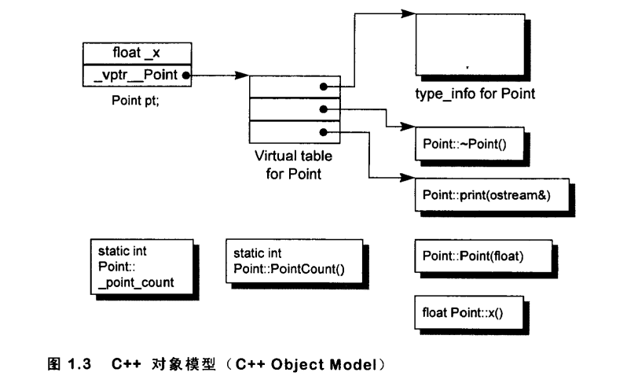

**加上继承**

c++支持单一继承，多重继承，虚拟继承，如下
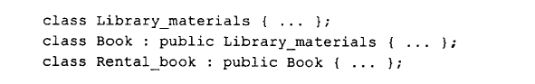
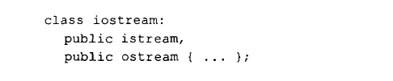
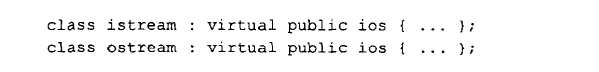

在虚拟继承的情况下，base class不管在继承串链中被派生（derived）多少次，永远只会在其派生对象中存在一个实体（称为subobject）·例如某个 iostream object之中就只有virtual ios base class 的一个subobject.
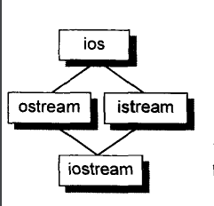

C++最初采用的继承模型，base class subobject的data members被直接放置于derived class object中．这提供了对base class members最紧凑而且最有效率的存取，缺点呢？当然就是：base class members的任何改变，包括增加、移除或改变类型等等，都使得所有用到此base class或其derived class的相关模块都必须重新编译．

自C++2.0起才新导入的virtual base class，需要一些间接的base class 表现方法．Virtual base class的原始模型是在class object 中为每一个有关联的virtual base class加上一个指针，其它演化出来的模型则若不是导入一个virtual base class table,就是拓展原存在的virtual table, 以便于维护每一个virtual base class的位置（在virtual table的相关slob中记录virtual base class subobject的偏移量）

根据以上对象模型，假设我们有class X，其定义了一个copy constructor, virtual destructor, and virtual function foo，我们有如下一段代码
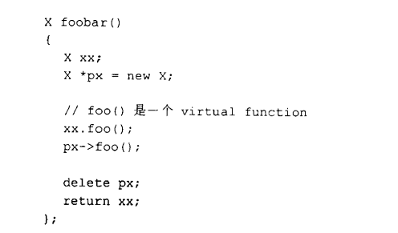
在编译器内部可能被转换为
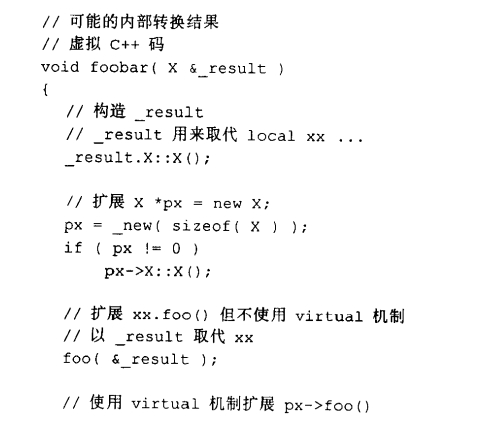
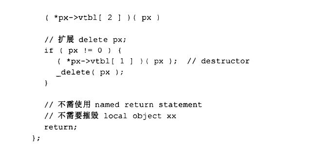
以上转换使用了NRV优化。

**struct versus class**
c++中同时支持struct 和class 这两个关键字。在c语言中，struct只表示一个数据集合，而在c++中，struct几乎与class等同，也可以有public，private, protected不同访问级别的区段，也可以有构造函数，析构函数，虚函数等等.

struct 与class的唯一区别，就是class的默认assess level是private，而struct是public.

当然有些在c程序中经常被使用的巧计，比如柔性数组，在struct的最后声明一个单一元素的数组，该struct于是拥有可变大小的数组，比如
```c
struct mumbel{
//...
char pc[1];
}

struct mumbel * pm=(struct mumbel *)malloc(sizeof(struct mumbel)+strlen(string)+1);

strcpy(&(pm->pc),string)
```
如果我们在c++中也这样使用，但是c++中对应的class中有多个access section, 并且也可能有虚函数，有基类，这时候，在class的末尾再声明一个单一元素的数组，这个成员实际并不一定存储在对象的末尾，因此也就不能像以上那样使用
```c++
class mumbel{
public:
//...
protected:
//...
private:
//....
char pc[1];
}
```

C++中凡处于同一个access section的数据，必定保证以其声明次序出现在内存布局当中．然而被放置在多个access sections中的各笔数据，排列次序就不一定了．上述的声明中，前述的c伎俩或许可以有效运行，或许不能，需视protected data members被放在private data members的前面或后面而定

同样的道理,base classes和derived classes的data members的布局也没有谁先谁后的强制规定，因而也就不保证前述的C伎俩一定有效. virtual functions的存在也会使得前述的C伎俩的有效性成为问号。所以不要在C++程序中这样用。

**三种程序设计范式**
C++程序设计支持三种设计范式
* 程序模型（procedural model），像C一样
  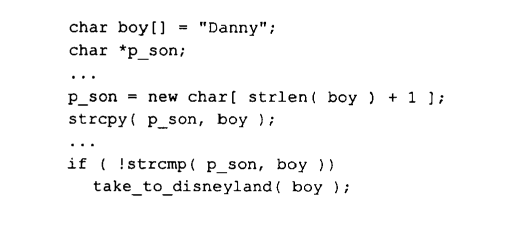
* ADT( abstract data type model, 抽象数据类型模型)，类中封装了数据，对外只提供操作接口
  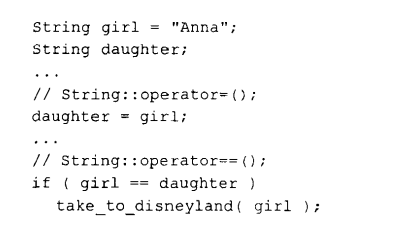
* 面向对象模型(object-oriented model)·在此模型中有一些彼此相关的class，通过一个base class（用以提供共通接口）被封装起来·
  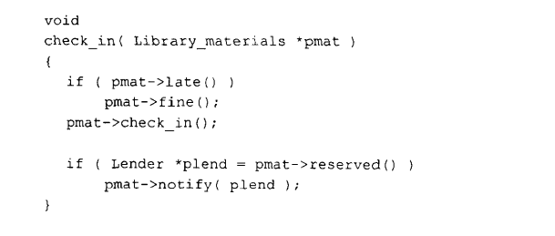

当程序设计使用面向对象模型，并且需要使用多态的性质时，需要通过base class的指针或者引用来调用接口。
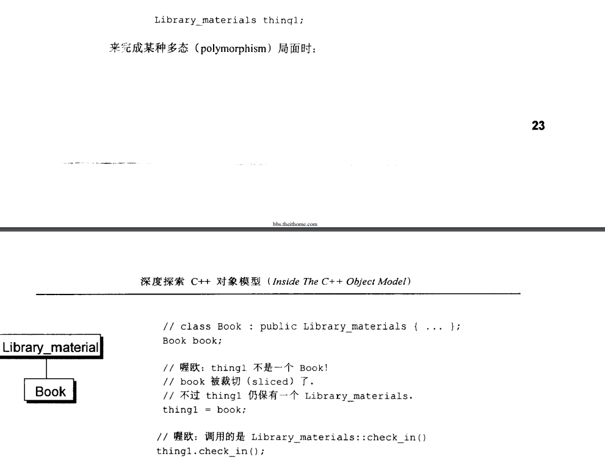
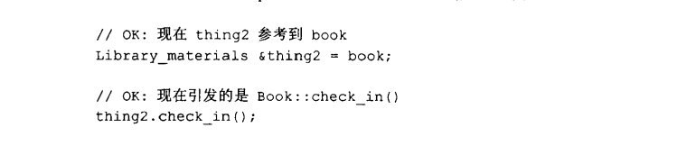

虽然你可以直接或间接处理继承体系中的一个base class object，但只有通过pointer或reference的间接处理，才支持OO程序设计所需的多态性质。上个例子中的thing2的定义和运用，是OO paradigm中一个良好的例证. thing1的定义和运用则逸出了OO的习惯，它反映的是一个ADT paradigm的良好行为,thing1行为是好是坏，视程序员的意图而定．在此范例中，它的行为非常有可能不是你要的！

在OO paradigm之中，程序员需要处理一个未知实体，它的类型虽然有所界定，却有无穷可能。这组类型受限于其继承体系，然而该体系理论上没有深度和广度的限制。原则上，被指定的object的真实类型在每一个特定执行点之前，是无法解析的。在C++中，只有通过pointers和references的操作才能够完成。相反地，在ADT paradigm中程序员处理的是一个拥有固定而单一类型的实体,它在编译时期就已经完全解析好了。

举个例子，下面这组声明：
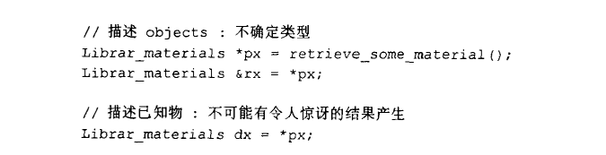
你绝对没有办法确定地说出px或rx到底指向何种类型的objects，你只能够说它要不就是Library_materials object,要不就是后者的一个派生object，我们倒是可以确定，dx只能是一个Library_materials object

C++ 通过以下方法支持多态

* 经由一组隐含的转化操作，例如把一个derived class指针转化为一个指向其public base class的指针：
  `shape *ps = new circle();`
* 经由virtual function 机制
  `ps->rotate();`
* 经由dynamic_cast和typeid运算符
  `if(circle *c = dynamic_cast<circle*>(ps) )...`

**需要多少内存才能表现一个class object?**
* non static data members总和的大小
* 为了alignment而padding的字节
* 支持virtual的overhead

假设有基类ZooAnimal,声明如下，并且定义了ZooAnimal对象za,和ZooAnimal的指针pza
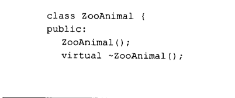
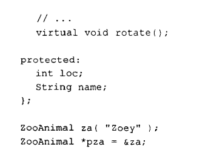

假设za存储在地址1000处，其内存布局如下
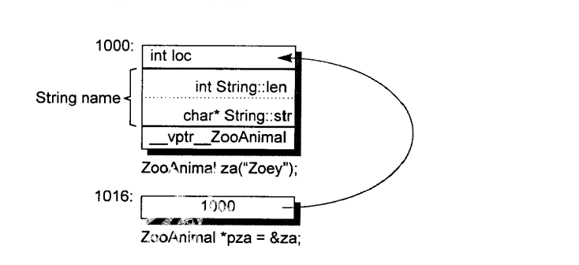

假设我们又声明了派生类Bear,并且定义了Bear对象和指针
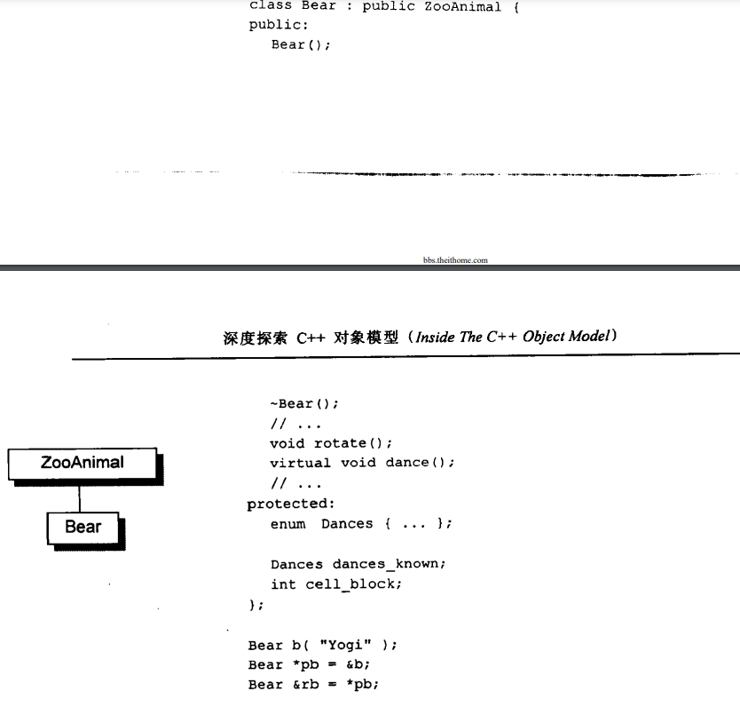
则其对象和指针的内存布局如下
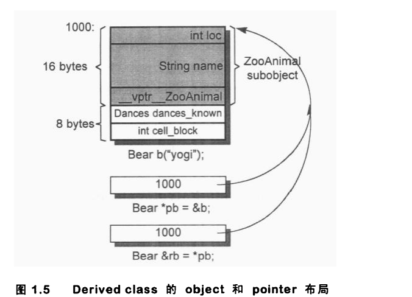

现在假设有如下代码
```c++
Bear b;
ZooAnimal *pz=&b;
Bear* pb=&b
```
pz 和pb都指向b对象的起始地址处，只不过通过pz指针仅仅能访问到ZooAnimal大小的内存范围，而通过pb可以访问全部的b对象大小的内存范围。

除了ZooAnimal subobject中的members,不能通过pz直接处理Bear中的members,唯一的例外是可以调用虚函数
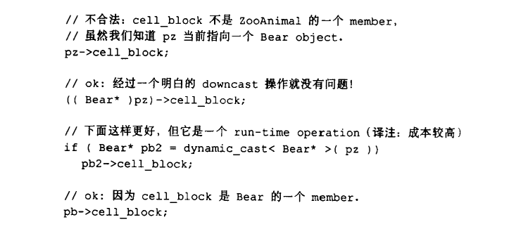
注意上述代码中的cell_block应该是public,不然不能被外部访问

如果我们调用
`pz->rotate();`
pz的类型将在编译时期决定以下两点
* 固定的可用接口，也就是说，pz只能够调用ZooAnimal的public接口．
* 该接口的access level

只有在运行时期，在该执行点，才能确定调用rotate的object到底是哪个。


### **Member Initialization List**
以下的case，必须在构造函数中使用初始化列表
* 初始化引用数据成员
* 初始化const数据成员
* 其base class subobject或者class member data需要调用非默认构造函数（构造函数中有参数）
  
最后一种情况，如果不在初始化列表中初始化，程序的编译和执行都没问题，但效率确很低
```c++
class Word {
  String _name;
  int _cnt;
public:
// not wrong, just naive ...
  Word() {
    _name = 0;
    _cnt = 0;
  }
};
```
这个构造函数首先默认初始化了_name,然后又调用了赋值运算，将初始化的值覆盖。这个赋值运算的过程中，创建并析构了一个临时的String 对象。

Here is the likely internal transformation of this constructor:
```c++
// Pseudo C++ Code
Word::Word( /* this pointer goes here */ )
{
// invoke default String constructor
_name.String::String();
// generate temporary
String temp = String( 0 );
// memberwise copy _name
_name.String::operator=( temp );
// destroy temporary
temp.String::~String();
_cnt = 0;
}
```

更有效率的构造函数如下
```c++
// preferred implementation
Word::Word : _name( 0 )
{
_cnt = 0;
}
```

This expands to something like this:
```c++
// Pseudo C++ Code
Word::Word( /* this pointer goes here */ )
{
// invoke String( int ) constructor
_name.String::String( 0 );
_cnt = 0;
}
```

This pitfall, by the way, is most likely to occur in template code of this form:
```c++
template < class type >
foo< type >::foo( type t )
{
// may or may not be a good idea
// depending on the actual type of type
_t = t;
}
```
编译器遍历初始化列表，根据成员声明的顺序，将其插入到构造函数中的合适位置处。并且初始化列表的代码，在explicit user code之前。

假设代码如下
```c++
class X {
  int i;
  int j;
public:
  // oops! do you see the problem?
  X( int val ): j( val ), i( j ){}
  ...
};
```
编译器应该对这种错误使用给个warning,但目前为止，只有g++编译器这样做了。

正确的初始化方式应该如下
```c++
// preferred idiom
X::X( int val )
: j( val )
{
i = j;
}
```

Another common question is whether you can invoke a member function to initialize a member, such as
```c++
// is the invocation of X::xfoo() ok?
X::X( int val ): i( xfoo( val )),j( val )
{}
```
xfoo()是X的一个函数成员。可以是可以，但还是要看xfoo()函数对object完整性的依赖度。

如果将xfoo()放在构造函数体中，而不是在初始化列表中，可以确保在xfoo()被调用时，object对象是完整的

最后，如下的调用成员函数来初始化基类，是否合理？
```c++
// is the invocation of FooBar::fval() ok?
class FooBar : public X {
int _fval;
public:
  int fval() { return _fval; }
  FooBar( int val ): _fval( val ),X( fval() ){}
...
};
```
其拓展可能如下
```c++
// Pseudo C++ Code
FooBar::FooBar( /* this pointer goes here */ )
{
// Oops: definitely not a good idea
X::X( this, this->fval() );
_fval = val;
};
```


In summary, the compiler iterates over and possibly reorders the initialization list to reflect the declaration order of the members. It inserts the code within the body of the constructor prior to any explicit user code.另外，基类的初始化在派生类之前。

