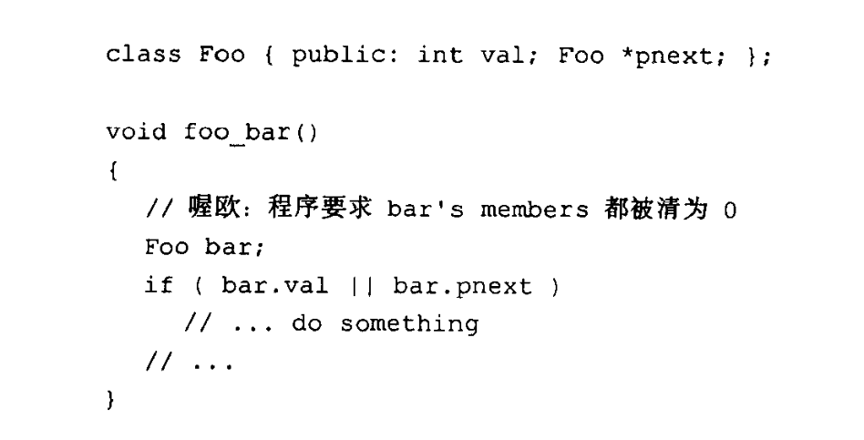
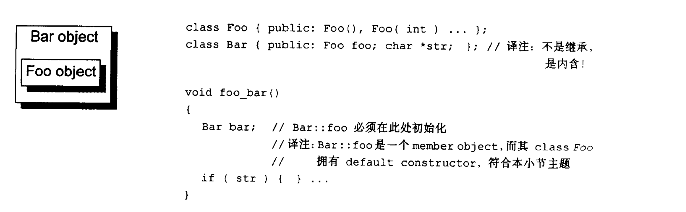
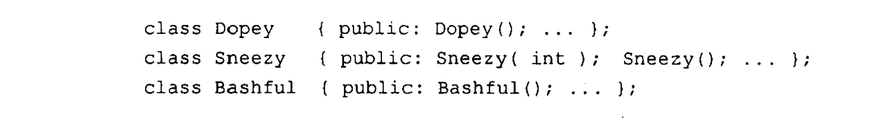
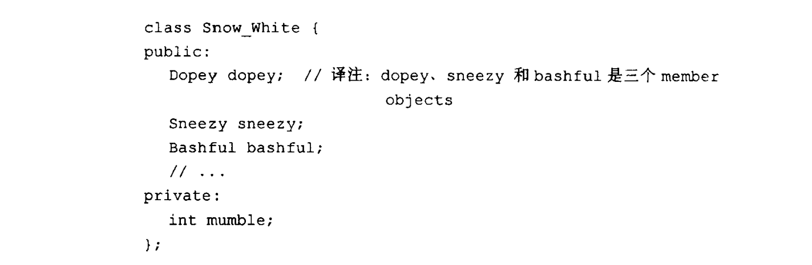
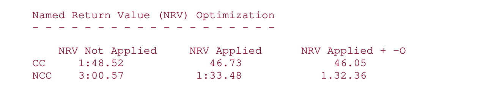

### **Default Constructor 的建构操作**

以上代码段中，编译器会给class Foo创建默认构造函数，将其data member都初始化为0么？答案是no

编译器会在需要的时候创建默认构造函数，并且这个默认构造函数只做编译器必要做的事情，比如实现virtual机制，调用基类的默认构造函数，调用data member的默认构造函数，如果这些基类，data member的默认构造函数是nontrivial的话。 否则编译器不会合成出默认构造函数，或者说合成出trivial 默认构造函数，其中什么也不做

如果想让上面这段代码正确工作，class Foo的设计者必须自己提供一个默认构造函数，将其data member初始化。

那么什么情况才是编译器认为需要的时候？（如果类的设计者没有提供任何构造函数（不包括拷贝构造函数），编译器会在**需要的时候**创建默认构造函数，这个函数是nontrivial的，其中会有必须执行的操作。 如果类的设计者已经提供了构造函数（默认的或者非默认的，同样不包括拷贝构造），编译器也可能会拓展其中的操作，如果这些拓展操作被认为是必要的话。）


**编译器认为需要合成nontrivial default constructor情况一**

其data member带有默认构造函数，这个构造函数要么是类的设计者声明的，要么是编译器默认创建的nontrivial构造函数。编译器会为此类合成默认构造函数。不过这个合成操作只有在constructor真正需要被调用时才会发生。

于是出现了一个有趣的问题，在C++各个不同的编译模块中，编译器如何避免合成出多个default constructor呢？解决方法是把合成的default constructor、copy constructor、destructor、assignment copy operator都以inline方式完成。如果函数太复杂，不适合做成inline，就会合成出一个explicit non-inline static实体



被合成的Bar default constructor内含必要的代码，能够调用class Foo的default constructor来处理member object Bar::foo，但它并不产生任何码来初始化Bar::str,是的，将Bar::foo初始化是编译器的责任，将Bar::str初始化则是程序员的责任。被合成出来的默认构造函数可能像这样：
```c++
inline Bar::Bar(){
    foo.Foo::Foo();
}
```
如果需要Bar::str也被正确初始化，程序员需要提供如下的默认构造函数：
```c++
Bar::Bar(){
    str=0;
}
```
这时候，编译器会对已经存在的构造函数进行拓展，拓展后的代码如下
```c++
Bar::Bar(){
    foo.Foo::Foo();
    str=0;
}
```
拓展的代码会在用户代码之前调用必要的构造函数。

如果有多个class member objects都要求constructor初始化操作，将如何呢？c++语言要求以member objects在class中的声明次序来调用各个conuctors。这一点由编译器完成，它为每一个constructor安插程序代码，以“member声明次序”调用每一个member所关联的default constructors.这些代码将被安插在explicit user code之前。举个例子，假设我们有以下三个classes：

以及一个class Snow_White:

如果Snow_White没有定义default constructor，就会有一个nontrivial constructor被合成出来，依序调用Dopey,Sneezy,Bashful的default constructors

然而如果定义了下面这样的default constructor：
```c++
Snow_White::Snow_White():sneezy(1024){
 mumbel=2048;
}
```
会被拓展成
```c++
Snow_White::Snow_White():snzzey(1024){
    dopey.Dopey::Dopey();
    sneezy.Sneezy::Sneezy(1024);
    bashful.Bashful::Bashful();
    mumbel=2048;
}
```

**编译器认为需要合成nontrivial default constructor情况二**

其base class带有default constuctor,这个构造函数要么是类的设计者声明的，要么是编译器默认创建的nontrivial构造函数

类似的道理，如果一个没有任何constructors（不包括拷贝构造函数）的class派生自一个带有default constructor 的 base class，那么这个derived class的default constructor会被视为nontrivial，并因此需要被合成出来。它将调用上一层base classes的default constructor（根据它们的声明次序）

如果设计者提供多个constructors（不包括拷贝构造函数），但其中都没有default constructor呢？编译器会扩张现有的每一个constructors，将必要的代码加进去·它不会合成一个新的default constructor，这是因为其它由user所提供的constructors存在的缘故。

如果同时亦存在着带有default constructors的member class objects，那些default constructor也会被调用,在所有base class default constructors都被调用之后·

**情况三**

带有virtual function,这个virtual function或者是本class 声明的，或者是继承的

为了支持virtual function机制，编译器会为每个带有virtual function的类创建一个虚函数表，其中包含指向其虚函数的指针。同时，每个类的对象中设置指向该表的指针。代码中通过基类的指针或引用调用虚函数的操作，会被编译器改写成通过访问虚函数表中的指针调用具体某个派生类的虚函数的操作。比如`pd->vfunc()`被改写成`(*pd->vptr[1])(pd)`,1是vfunc虚函数在虚函数表中的索引。

正是因为有这些操作要做，如果没有构造函数，编译器需要合成默认构造函数做这些操作。如果有构造函数，需要对已有的构造函数做拓展。

**情况四**

带有virtual base class。同带有virtual function一样的道理，都需要为virtual机制的实现提供必要的操作。

Virtual base class的实现法在不同的编译器之间有极大的差异。然而，每一种实现法的共通点在于必须使virtual base class在其每一个derived class object中的位置，能够于执行期准备妥当。例如下面这段程序代码中：


因为这里需要支持virtual base class,编译器无法在编译期决议出X::i的实际偏移位置，因为不能确定pa的实际类型。
如果X不是被虚拟继承的，则这里的调用操作可以在编译期被决议到具体的地址。

编译器必须改变pa->i代码，使得对X::i的决议可以延迟至执行期才决定下来。原先cfront的做法是靠在派生类中，对每个虚基类，存储一个指向该基类的指针·所有“经由reference或
pointer来存取一个virtual base class”的操作都可以通过相关指针完成。在我的例子中，可以被改写如下，以符合这样的实现策略:
```c++
void foo(const A * pa){
    pa->_vbcX->i = 1024;
}
```


以上便是编译器需要合成default constructor的四种情况。

至于没有存在这四种情况而又没有声明任何constructor的classes，我们说它们拥有的是implicit trivial default constructors，它们实际上并不会被合成出来。


### **Copy Constructor**的建构操作
有三种情况，会以一个object的内容作为另一个object的初值
* A x = b;
* 以一个object作为参数传入函数
* 函数返回一个object
  
如果class提供了一个copy contructor, 如下
```c++
A::A(const A& a);
B::B(const B& b, int y=0);
```
在大部分情况下，一个class object以另一个同类object作为初值时，copy constructor会被调用

如果class没有提供相应的copy constructor, 编译器会合成出默认的拷贝构造函数，这个拷贝构造函数，要么是nontrivial的，要么的trivial的。当然，如果是trivial的，实际上这个拷贝构造函数并没有被真正合成出来。 trivial是指class的拷贝可以bitwise copy，也就是逐位拷贝完成。

如果一个类中有virtual函数，继承virtual基类，则不能逐位拷贝，合成出的拷贝构造函数要实现virtual机制的支持。

如果一个类中有class data member提供了拷贝构造函数，或者base class提供了拷贝构造函数，这些拷贝构造函数，可以是类设计者提供的，也可以是编译器合成的nontrivial 拷贝构造函数，这时候，该类也不具备bitwise copy semantics，编译器合成出的拷贝构造函数中需要调用基类或者 class data member的拷贝构造函数。

* **拷贝构造函数处理virtual function**
  
对于virtual函数的支持，假设有如下两个类：


ZooAnimal class object以另一个ZooAnimal class object作为初值，或Bear class object以另一个Bear class object作为初值，都可以直接靠"bitwise copy semantics”完成。因为其vptr都指向同一个虚函数表。

而以一个derived class object初始化一个base class object时，不能将derived class object的vptr直接拷贝给base class object, 否则下段代码中，调用draw(franny),本来应该调用ZooAnimal::draw(),因为直接拷贝的vptr,franny中的vptr指向了Bear类的虚函数表，变成调用了Bear::draw();
```c
void draw(ZooAnimal &zoo){zoo.draw();}
void foo(){
    Bear yogi;
    ZooAnimal franny = yogi;
    draw(yogi); //调用Bear::draw();
    draw(franny); //调用Bear::draw();
}
```
所以，拷贝构造函数中，需要对vptr进行设置，而不能直接拷贝。这由编译器完成。

* **拷贝构造函数处理virtual base class**

Virtual base class的存在需要特别处理。一个class object如果以另一个object作为初值，而后者有一个virtual base class subobject，那么也会使"bitwise copy semantics"失效。


每一个编译器对于虚拟继承的支持承诺，都表示必须derived class object中的virtual base class subobject位置,在执行期就准备妥当。维护"位置的完整性"是编译器的责任.

“Bitwise copy semantics"可能会破坏这个位置，所以编译
器必须在它自己合成出来的copy constructor中做出仲裁。

如下

编译器所产生的代码（调用ZooAnimal的default constructor、将Raccoon的vptr初始化，并定位出Raccoon中的ZooAnimal subobject）被安插在两个Raccoon constructors之内，成为其先头部队·

如果以一个Raccoon object初始化另一个Raccoon object，bitwise copy是可以的，但如果一个 class object以其derived class object作为初值，比如现在又有一个RedPanda class,如下

以一个RedPanda object初始化一个Raccoon object,在这种情况下，为了完成正确的Raccoon object初值设定，编译器必须合成一个copy constructor，安插一些码以设定virtual base class pointer/offset的初值（或只是简单地确定它没有被抹消）

而如果是这样调用
```c++
Raccoon *ptr;
RedPanda panda = *ptr
```
这时候，编译器无法知道是否"bitwise copy semantics”是否还保持着，因为它无法知道（没有流程分析）Raccoon指针是否指向一个真正的Raccoon object，或是指向一个derived class object. 注意，上述代码如果不对 Raccoon 指针做类型转换的话，应该会报错的。隐式转换只在从派生类转换为基类时发生，基类转换为派生类需要显示转换。

### **Program Transformation Semantics**
已知下面程序片段
```c++
#include "X.h"

X foo(){
    X xx;
    //...
    return xx;
}
```
一个程序员可能会假设， 
* foo()函数的每次调用，都会创建xx local object,并且以传值的方式拷贝返回。
* 如果X定义了拷贝构造函数，则每次调用foo()时，都会调用X的拷贝构造函数


然而，1的真实性取决于类X的定义。2在某种程度上也依赖于类X的定义，但主要取决于C++编译器提供的优化程度。为了颠覆这些观点，甚至可以断言，在高质量的C++编译器实现中，这两点都不成立

如下代码，
```c++
X x0;
void foo_bar() {
X x1( x0 );
X x2 = x0;
X x3 = x( x0 );
// ...
}
```

The required program transformation is two-fold:
* Each definition is rewritten with the initialization stripped out.
* An invocation of the class copy constructor is inserted.

这里的定义是指的占用内存的行为，而不是调用了默认构造函数。

For example, foo_bar() might look as follows after this straightforward, two-fold transformation:
```c++
// Possible program transformation
// Pseudo C++ Code
void foo_bar() {
X x1;
X x2;
X x3;
// compiler inserted invocations
// of copy constructor for X
x1.X::X( x0 );
x2.X::X( x0 );
x3.X::X( x0 );
// ...
}
```
where the call`x1.X::X( x0 );`represents a call of the copy constructor
`X::X( const X& xx );`

#### **Argument Initialization**
假设我们有如下代码
```c++
void foo( X x0 );

X xx;
// ...
foo( xx );
```

xx 是怎么作为参数传递给foo函数的？一种方式是在foo函数栈外初始化好x0参数，然后在foo中直接引用这个x0,转换的伪代码如下：
```c++
X __temp; //伪定义操作，只分配内存
__temp.X::X(xx); //调用拷贝初始化
foo(__temp); //注意这里foo被转换为void foo(X& x0);
```
这个__temp会在foo函数返回**后**调用析构函数销毁。

另一种方式是在foo函数栈内调用拷贝构造函数创建x0,并在foo函数返回**前**销毁创建的x0.
当然，这种情况，foo也会被转换成 void foo(X& x); 其转换的伪代码如下
```c++
void foo(X& x){
    X x0; //伪定义操作，只分配内存
    x0.X::X(x);
    //....
    X0.X::~X();
    return;
}
```
之前了解到的函数栈的参数和返回值的传递，其被调函数的参数，都是在调用函数栈中构建的，当然，那些讲解都是一builtin type为例。
函数参数对象的传递，如果参数类型不是引用类型，都是需要调用拷贝构造函数的。

#### **Return Value Initialization**
下面一段代码中，bar函数的返回值X是如何被xx拷贝初始化的呢？
```c++
X bar()
{
X xx;
// process xx ...
return xx;
}
```
1. 首先添加一个引用，引用到返回值。也就是需要在函数中知道返回对象所在的地址。
2. 在返回之前，给这个地址处的对象做拷贝初始化。


最后的`return xx;` 就变成了`return;`

转换的伪代码如下
```c
// function transformation to reflect
// application of copy constructor
// Pseudo C++ Code
void
bar( X& __result )
{
X xx;
// compiler generated invocation
// of default constructor
xx.X::X();
// ... process xx
// compiler generated invocation
// of copy constructor
__result.X::X( xx );
return;
}
```

也就是说，这一过程，也是要调用拷贝初始化的。


到目前为止，我们看到一个函数,以如下这种方式被调用时
```c++
X bar(X x0)；

X x1;
//.....
bar(x1);
```
其参数和返回值，都需要调用拷贝构造函数，那么这一过程如何被优化呢？


#### **Optimization at the User Level**
讲的是狗屁，跳过。
也就是说，对参数的拷贝构造函数的调用，一般是无法优化掉的。除非函数声明中参数为引用就好了。

#### **Optimization at the Compiler Level**
假设bar()的函数代码如下
```c++
X bar()
{
X xx;
// ... process xx
return xx;
}
```
所谓的NRV优化，就是最后的`return xx`这个语句，调用X的拷贝构造函数，用函数中的临时对象xx初始化返回值。与其这样，不如一开始就通过对返回值直接在函数中处理好，然后直接`return`就好了。省去了最后调用拷贝构造函数。
其伪代码表示如下
```c++
bar( X &__result )
{
// default constructor invocation
// Pseudo C++ Code
__result.X::X();
// ... process in __result directly
return;
}
```
To get a sense of the performance gain, consider the following class:
```c++
class test {
friend test foo( double );
public:
    test(){ memset( array, 0, 100*sizeof( double )); }
private:
    double array[ 100 ];
};
```
Consider also the following function, which creates, modifies, and returns a test class object:
```c++
test foo( double val )
{
    test local;
    local.array[ 0 ] = val;
    local.array[ 99 ] = val;
    return local;
}
```
and a main() routine that calls the function 10 million times:
```c++
int main()
{
    for ( int cnt = 0; cnt < 10000000; cnt++ )
        { test t = foo( double( cnt )); }
    return 0;
}
```
测试的第一个实例，其test类没有提供拷贝构造函数，同时编译器也没有合成拷贝构造函数，因为该类有bitwise copy semantics。
而测试的第二个实例，其tests类提供了如下的拷贝构造函数
```c++
inline
test::test( const test &t )
{
memcpy( this, &t, sizeof( test ));
}
```
如果一个类没有拷贝构造函数，NRV优化便没有被打开，只有一个类有拷贝构造函数，以上的foo函数才会被NRV优化。

以下是两个编译器的测试结果


可以看到效率的提神是很明显的。

所以，如果一个类，本身具备bitwise copy semantic的情况下，本身是不需要提供拷贝构造函数的。然而，如果这个类需要大量的拷贝初始化，例如需要以传值的方式传回object,这时候，提供拷贝构造函数可以打开NRV优化，对程序效率的提升是很明显的。

例如如下的Point3d class 

支持以下操作

所有这些操作都符合可被NRV优化的模式
```c++
{
    Point3d result;
    //计算result...
    return result;
}

```
这时候应该考虑提供拷贝构造函数

然而不管使用memcpy,或者是memset，都只有在classes不含任何由编译器产生的内部members时才能有效运行。如果Point3d class 声明一个或一个以上的virtual functions，或内含一个virtual base class，那么使用上述函数将会导致那些被编译器产生的内部members的初值被改写。例如，已知下面声明：


总结一下NRV优化
简单来说，符合以下模式的函数
```c++
X foo(){
    X xx;
    //....;
    return xx;
}
```
没有优化前的编译器拓展
```c++
//伪代码
void foo(X& _result){
    X xx; //定义，只分配内存
    xx.X::X();
    //....
    _result.X(xx); //调用拷贝构造函数
    return;
}
```
如果给X提供了拷贝构造函数，编译器可以选择应用NRV优化。如果编译器应用了NRV优化，便不再在函数栈中创建xx local object,而是直接对返回对象操作。如下，省去了调用拷贝构造函数。
```c++
void foo(X& _result){
    _result.X::X();
    //....直接操作_result
    return;

}
```